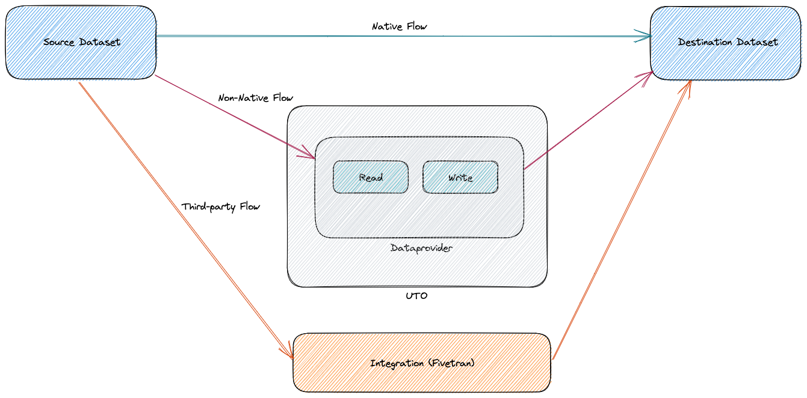

<h1 align="center">
  Universal Transfer Operator
</h1>
  <h3 align="center">
transfers made easy<br><br>
</h3>


[](https://github.com/astronomer/apache-airflow-provider-transfers)

The **Universal Transfer Operator** allows data transfers between any supported source and target Datasets in [Apache Airflow](https://airflow.apache.org/). It offers a consistent agnostic interface, simplifying the users' experience, so they do not need to use specific providers or operators for transfers. The Astro Python SDK is maintained by [Astronomer](https://astronomer.io).

This ensures a consistent set of data providers that can read from and write to dataset. The Universal Transfer
Operator can use the respective data providers to transfer between as a source and a destination. It also takes advantage of any existing fast and
direct high-speed endpoints, such as Snowflake's built-in ``COPY INTO`` command to load S3 files efficiently into Snowflake.

Universal transfer operator also supports the transfers using third-party platforms like Fivetran.

## How Universal Transfer Operator Works




With universal transfer operator, users can perform data transfers using the following transfer modes:

1. non-native
2. native
3. third-party

### Non-native transfer

When we load a data located in one dataset located in cloud to another dataset located in cloud, internally the steps involved are:

Steps:

- Get the dataset data in chunks from dataset storage to the worker node.
- Send data to the cloud dataset from the worker node.

This is the default way of transferring datasets. There are performance bottlenecks because of limitations of memory, processing power, and internet bandwidth of worker node.

Following is an example of non-native transfers between Google cloud storage and Sqlite:

https://github.com/astronomer/apache-airflow-provider-transfers/blob/main/example_dags/example_universal_transfer_operator.py#L37-L41

### Improving bottlenecks by using native transfer

Some datasets on cloud like Bigquery and Snowflake support native transfer to ingest data from cloud storage directly. Using this we can ingest data much quicker and without any involvement of the worker node.

Steps:

- Request destination dataset to ingest data from the file dataset.
- Destination dataset request source dataset for data.

This is a faster way for datasets of larger size as there is only one network call involved and usually the bandwidth between vendors is high. Also, there is no requirement for memory/processing power of the worker node, since data never gets on the node. There is significant performance improvement due to native transfers.

> **_NOTE:_**
   Native implementation is in progress and will be added in upcoming releases.


### Transfer using third-party tool
The universal transfer operator can work smoothly with other platforms like FiveTran for data transfers.

Here is an example of how to use Fivetran for transfers:

https://github.com/astronomer/apache-airflow-provider-transfers/blob/main/example_dags/example_dag_fivetran.py#L52-L58


## Quickstart
- Clone repository and build locally using docker:
    ```shell
    make container target=build-run
    ```

   Copy the example DAGs to `AIRFLOW_HOME` DAG folder and run the DAG.

- Clone repository and run using `nox`

    ```shell
    nox -s dev
    ```

## Supported technologies

- Databases supported:

    https://github.com/astronomer/apache-airflow-provider-transfers/blob/main/src/universal_transfer_operator/constants.py#L72-L74

- File store supported:

    https://github.com/astronomer/apache-airflow-provider-transfers/blob/main/src/universal_transfer_operator/constants.py#L26-L32

## Documentation

The documentation is a work in progress -- we aim to follow the [Diátaxis](https://diataxis.fr/) system.

To build-docs locally:

```shell
nox -s build_docs
```

## Changelog

The **UNIVERSAL TRANSFER OPERATOR** follows semantic versioning for releases. Check the [changelog](/docs/CHANGELOG.md) for the latest changes.

## Release managements

To learn more about our release philosophy and steps, see [Managing Releases](/docs/development/RELEASE.md).

## Contribution guidelines

All contributions, bug reports, bug fixes, documentation improvements, enhancements, and ideas are welcome.

Read the [Contribution Guideline](/docs/development/CONTRIBUTING.md) for a detailed overview on how to contribute.

Contributors and maintainers should abide by the [Contributor Code of Conduct](CODE_OF_CONDUCT.md).

## License

[Apache Licence 2.0](LICENSE)
